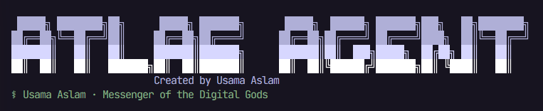

<p align="center">
  
</p>

# Atlas Agent ☤
<p align="center">
  <a href="#quick-install">Atlas Agent</a> | <a href="website/docs/getting-started/installation.md">Documentation</a>
</p>
<p align="center">
  <a href="website/docs/getting-started/installation.md"></a>
  <a href="LICENSE"></a>
  
</p>

**The self-improving AI agent created by Usama Aslam.** It's the only agent with a built-in learning loop — it creates skills from experience, improves them during use, nudges itself to persist knowledge, searches its own past conversations, and builds a deepening model of who you are across sessions. Run it on a $5 VPS, a GPU cluster, or serverless infrastructure that costs nearly nothing when idle. It's not tied to your laptop — talk to it from Telegram while it works on a cloud VM.

Use any compatible model provider you want — OpenRouter, OpenAI, your own endpoint, and many others. Switch with `atlas model` — no code changes, no lock-in.

<table>
<tr><td><b>A real terminal interface</b></td><td>Full TUI with multiline editing, slash-command autocomplete, conversation history, interrupt-and-redirect, and streaming tool output.</td></tr>
<tr><td><b>Lives where you do</b></td><td>Telegram, Discord, Slack, WhatsApp, Signal, and CLI — all from a single gateway process. Voice memo transcription, cross-platform conversation continuity.</td></tr>
<tr><td><b>A closed learning loop</b></td><td>Agent-curated memory with periodic nudges. Autonomous skill creation after complex tasks. Skills self-improve during use. FTS5 session search with LLM summarization for cross-session recall. <a href="https://github.com/plastic-labs/honcho">Honcho</a> dialectic user modeling. Compatible with the <a href="https://agentskills.io">agentskills.io</a> open standard.</td></tr>
<tr><td><b>Scheduled automations</b></td><td>Built-in cron scheduler with delivery to any platform. Daily reports, nightly backups, weekly audits — all in natural language, running unattended.</td></tr>
<tr><td><b>Delegates and parallelizes</b></td><td>Spawn isolated subagents for parallel workstreams. Write Python scripts that call tools via RPC, collapsing multi-step pipelines into zero-context-cost turns.</td></tr>
<tr><td><b>Runs anywhere, not just your laptop</b></td><td>Six terminal backends — local, Docker, SSH, Singularity, Modal, and Daytona. Daytona and Modal offer serverless persistence — your agent's environment hibernates when idle and wakes on demand, costing nearly nothing between sessions. Run it on a $5 VPS or a GPU cluster.</td></tr>
<tr><td><b>Research-ready</b></td><td>Batch trajectory generation, trajectory compression for training the next generation of tool-calling models.</td></tr>
</table>

---

## Quick Install

### One-line source installer

The install scripts live in this repo and clone the Atlas source checkout into a managed environment:

```bash
curl -fsSL https://raw.githubusercontent.com/theusamaaslam/AtlasAgent/main/scripts/install.sh | bash
```

Windows PowerShell:

```powershell
iex (irm https://raw.githubusercontent.com/theusamaaslam/AtlasAgent/main/scripts/install.ps1)
```

Forked or private deployments can keep the same scripts and point them at a different repository:

```bash
ATLAS_AGENT_REPO_HTTPS=https://github.com/your-org/atlas-agent.git \
  curl -fsSL https://raw.githubusercontent.com/your-org/atlas-agent/main/scripts/install.sh | bash
```

### Linux, macOS, WSL2, Termux

```bash
python -m pip install atlas-agent
```

### Windows (native, PowerShell)

> **Heads up:** Native Windows runs Atlas without WSL — CLI, gateway, TUI, and tools all work natively. If you'd rather use WSL2, the Linux/macOS one-liner above works there too.

Run this in PowerShell:

```powershell
py -m pip install atlas-agent
```

The installer handles everything: uv, Python 3.11, Node.js, ripgrep, ffmpeg, **and a portable Git Bash** (MinGit, unpacked to `%LOCALAPPDATA%\atlas\git` — no admin required, completely isolated from any system Git install). Atlas uses this bundled Git Bash to run shell commands.

If you already have Git installed, the installer detects it and uses that instead. Otherwise a ~45MB MinGit download is all you need — it won't touch or interfere with any system Git.

> **Android / Termux:** Use the Termux guide in `website/docs/getting-started/termux.md`. On Termux, Atlas installs a curated `.[termux]` extra because the full `.[all]` extra currently pulls Android-incompatible voice dependencies.
>
> **Windows:** Native Windows is fully supported — the PowerShell one-liner above installs everything. If you'd rather use WSL2, the Linux command works there too. Native Windows install lives under `%LOCALAPPDATA%\atlas`; WSL2 installs under `~/.atlas` as on Linux.

After installation:

```bash
source ~/.bashrc    # reload shell (or: source ~/.zshrc)
atlas              # start chatting!
```

## Production Dashboard Deployment

Use the deploy helper when you want a machine-accessible dashboard on port `9119` with password authentication configured up front:

```bash
curl -fsSL https://raw.githubusercontent.com/theusamaaslam/AtlasAgent/main/scripts/deploy-dashboard.sh | bash
```

Recommended explicit production form:

```bash
ATLAS_HOST=0.0.0.0 \
ATLAS_PORT=9119 \
ATLAS_DASHBOARD_USER=admin \
ATLAS_DASHBOARD_PASSWORD='replace-with-a-long-random-password' \
curl -fsSL https://raw.githubusercontent.com/theusamaaslam/AtlasAgent/main/scripts/deploy-dashboard.sh | bash
```

The script installs Atlas, writes `dashboard.basic_auth.username` and `dashboard.basic_auth.password_hash`, starts `atlas dashboard --host "$ATLAS_HOST" --port "$ATLAS_PORT" --no-open`, and prints the dashboard URL plus credentials. Logs are written to `$ATLAS_HOME/logs/dashboard.log`.

For manual deployments:

```bash
atlas setup
atlas dashboard --host 0.0.0.0 --port 9119 --no-open
```

Do not expose `atlas dashboard` on a public interface without an auth provider. The dashboard server refuses unsafe public binds without authentication.

### Troubleshooting

#### Windows Defender or antivirus flags `uv.exe` as malware

If your antivirus (Bitdefender, Windows Defender, etc.) quarantines `uv.exe` from the Atlas `bin` folder (`%LOCALAPPDATA%\atlas\bin\uv.exe`), this is a **false positive**. The file is Astral's `uv` — the Rust Python package manager Atlas bundles to manage its Python environment. ML-based antivirus engines commonly flag unsigned Rust binaries that download and install packages.

**To verify your copy is authentic:**

```powershell
# Install GitHub CLI if needed
winget install --id GitHub.cli

# Login to GitHub
gh auth login

# Run verification
$uv = "$env:LOCALAPPDATA\atlas\bin\uv.exe"
$ver = (& $uv --version).Split(' ')[1]
[Net.ServicePointManager]::SecurityProtocol = [Net.SecurityProtocolType]::Tls12
$zip = "$env:TEMP\uv.zip"
Invoke-WebRequest "https://github.com/astral-sh/uv/releases/download/$ver/uv-x86_64-pc-windows-msvc.zip" -OutFile $zip -UseBasicParsing
gh attestation verify $zip --repo astral-sh/uv
Expand-Archive $zip "$env:TEMP\uv_x" -Force
(Get-FileHash "$env:TEMP\uv_x\uv.exe").Hash -eq (Get-FileHash $uv).Hash
```

If attestation says "Verification succeeded" and the last line prints `True`, you're good.

**To whitelist Atlas:**
- **Windows Defender:** Run PowerShell as Admin → `Add-MpPreference -ExclusionPath "$env:LOCALAPPDATA\atlas\bin"`
- **Bitdefender:** Add an exception in the Bitdefender console (Protection > Antivirus > Settings > Manage Exceptions)
- Whitelist the **folder**, not the file hash — Atlas updates `uv` and the hash changes every version

For more context, see the upstream Astral reports: [astral-sh/uv#13553](https://github.com/astral-sh/uv/issues/13553), [astral-sh/uv#15011](https://github.com/astral-sh/uv/issues/15011), [astral-sh/uv#10079](https://github.com/astral-sh/uv/issues/10079).

---

## Getting Started

```bash
atlas              # Interactive CLI — start a conversation
atlas model        # Choose your LLM provider and model
atlas tools        # Configure which tools are enabled
atlas config set   # Set individual config values
atlas gateway      # Start the messaging gateway (Telegram, Discord, etc.)
atlas setup        # Run the full setup wizard (configures everything at once)
atlas claw migrate # Migrate from OpenClaw (if coming from OpenClaw)
atlas update       # Update to the latest version
atlas doctor       # Diagnose any issues
```

📖 **Full documentation:** `website/docs/`

---

## Configure Models And Tools

Atlas works with whatever compatible provider you want. Run the setup wizard, choose a model provider, and then enable only the tools you need:

```bash
atlas setup
atlas model
atlas tools
```

You can bring your own keys per tool whenever you want; tool backends are configurable one at a time.

---

## CLI vs Messaging Quick Reference

Atlas has two entry points: start the terminal UI with `atlas`, or run the gateway and talk to it from Telegram, Discord, Slack, WhatsApp, Signal, or Email. Once you're in a conversation, many slash commands are shared across both interfaces.

| Action                         | CLI                                           | Messaging platforms                                                              |
| ------------------------------ | --------------------------------------------- | -------------------------------------------------------------------------------- |
| Start chatting                 | `atlas`                                      | Run `atlas gateway setup` + `atlas gateway start`, then send the bot a message |
| Start fresh conversation       | `/new` or `/reset`                            | `/new` or `/reset`                                                               |
| Change model                   | `/model [provider:model]`                     | `/model [provider:model]`                                                        |
| Set a personality              | `/personality [name]`                         | `/personality [name]`                                                            |
| Retry or undo the last turn    | `/retry`, `/undo`                             | `/retry`, `/undo`                                                                |
| Compress context / check usage | `/compress`, `/usage`, `/insights [--days N]` | `/compress`, `/usage`, `/insights [days]`                                        |
| Browse skills                  | `/skills` or `/<skill-name>`                  | `/<skill-name>`                                                                  |
| Interrupt current work         | `Ctrl+C` or send a new message                | `/stop` or send a new message                                                    |
| Platform-specific status       | `/platforms`                                  | `/status`, `/sethome`                                                            |

For the full command lists, see `website/docs/user-guide/cli.md` and `website/docs/user-guide/messaging/index.md`.

---

## Documentation

All documentation lives in `website/docs/`:

| Section                                                                                             | What's Covered                                             |
| --------------------------------------------------------------------------------------------------- | ---------------------------------------------------------- |
| `website/docs/getting-started/quickstart.md`                 | Install → setup → first conversation in 2 minutes          |
| `website/docs/user-guide/cli.md`                             | Commands, keybindings, personalities, sessions             |
| `website/docs/user-guide/configuration.md`                   | Config file, providers, models, all options                |
| `website/docs/user-guide/messaging/index.md`                 | Telegram, Discord, Slack, WhatsApp, Signal, Home Assistant |
| `website/docs/user-guide/security.md`                        | Command approval, DM pairing, container isolation          |
| `website/docs/user-guide/features/tools.md`                  | 40+ tools, toolset system, terminal backends               |
| `website/docs/user-guide/features/skills.md`                 | Procedural memory, Skills Hub, creating skills             |
| `website/docs/user-guide/features/memory.md`                 | Persistent memory, user profiles, best practices           |
| `website/docs/user-guide/features/mcp.md`                    | Connect any MCP server for extended capabilities           |
| `website/docs/user-guide/features/cron.md`                   | Scheduled tasks with platform delivery                     |
| `website/docs/user-guide/features/context-files.md`          | Project context that shapes every conversation             |
| `website/docs/developer-guide/architecture.md`               | Project structure, agent loop, key classes                 |
| `website/docs/developer-guide/contributing.md`               | Development setup, PR process, code style                  |
| `website/docs/reference/cli-commands.md`                     | All commands and flags                                     |
| `website/docs/reference/environment-variables.md`            | Complete env var reference                                 |

---

## Migrating from OpenClaw

If you're coming from OpenClaw, Atlas can automatically import your settings, memories, skills, and API keys.

**During first-time setup:** The setup wizard (`atlas setup`) automatically detects `~/.openclaw` and offers to migrate before configuration begins.

**Anytime after install:**

```bash
atlas claw migrate              # Interactive migration (full preset)
atlas claw migrate --dry-run    # Preview what would be migrated
atlas claw migrate --preset user-data   # Migrate without secrets
atlas claw migrate --overwrite  # Overwrite existing conflicts
```

What gets imported:

- **SOUL.md** — persona file
- **Memories** — MEMORY.md and USER.md entries
- **Skills** — user-created skills → `~/.atlas/skills/openclaw-imports/`
- **Command allowlist** — approval patterns
- **Messaging settings** — platform configs, allowed users, working directory
- **API keys** — allowlisted secrets (Telegram, OpenRouter, OpenAI, Anthropic, ElevenLabs)
- **TTS assets** — workspace audio files
- **Workspace instructions** — AGENTS.md (with `--workspace-target`)

See `atlas claw migrate --help` for all options, or use the `openclaw-migration` skill for an interactive agent-guided migration with dry-run previews.

---

## Contributing

We welcome contributions! See `website/docs/developer-guide/contributing.md` for development setup, code style, and PR process.

Quick start for contributors — use the standard installer, then work from the
full git checkout it creates at `$ATLAS_HOME/atlas-agent` (usually
`~/.atlas/atlas-agent`). This matches the layout used by `atlas update`, the
managed venv, lazy dependencies, gateway, and docs tooling.

```bash
python -m pip install atlas-agent
cd "${ATLAS_HOME:-$HOME/.atlas}/atlas-agent"
uv pip install -e ".[all,dev]"
scripts/run_tests.sh
```

Manual clone fallback (for throwaway clones/CI where you intentionally do not
want the managed install layout):

Create the venv outside the cloned source tree — a venv inside the directory
the agent operates from can be wiped by a relative-path command the agent runs
against its own checkout, destroying the running runtime mid-session.

```bash
curl -LsSf https://astral.sh/uv/install.sh | sh
uv venv ~/.atlas/venvs/atlas-dev --python 3.11
source ~/.atlas/venvs/atlas-dev/bin/activate
uv pip install -e ".[all,dev]"
scripts/run_tests.sh
```

---

## Community

- 📚 [Skills Hub](https://agentskills.io)
- 🔌 [computer-use-linux](https://github.com/avifenesh/computer-use-linux) — Linux desktop-control MCP server for Atlas and other MCP hosts, with AT-SPI accessibility trees, Wayland/X11 input, screenshots, and compositor window targeting.
- 🔌 [AtlasClaw](https://github.com/AaronWong1999/atlasclaw) — Community WeChat bridge: Run Atlas Agent and OpenClaw on the same WeChat account.

---

## License

MIT — see [LICENSE](LICENSE).

Built by Usama Aslam.
